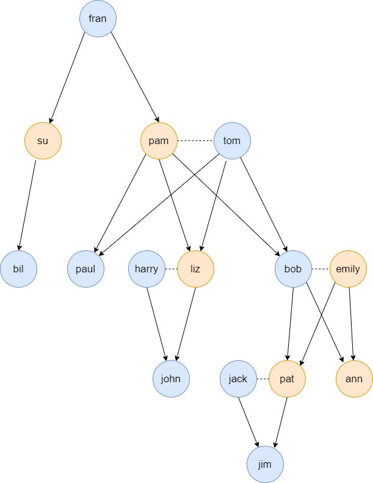
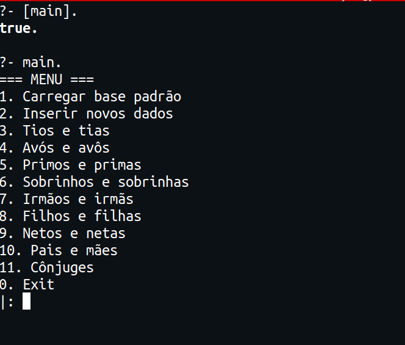
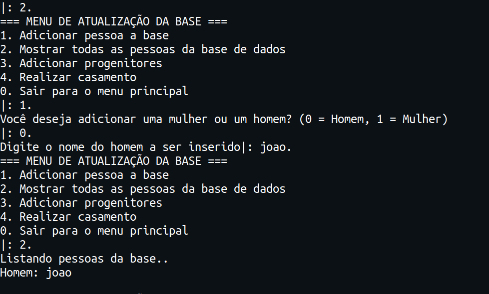
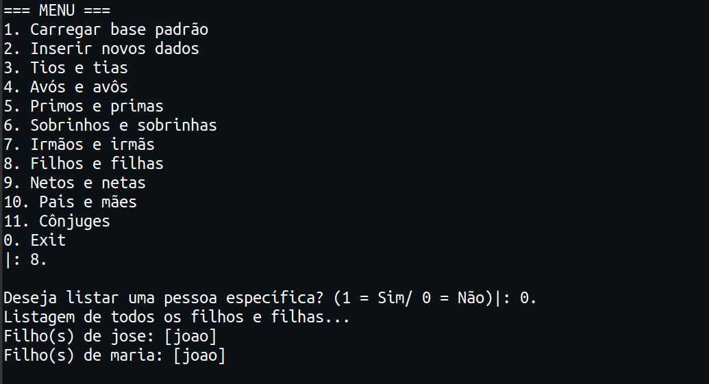
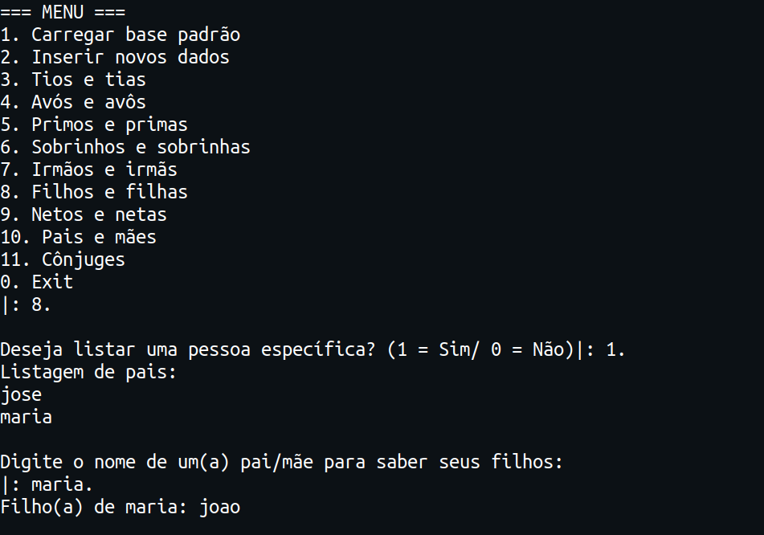

# Arvore_GeNeyalogica

**Disciplina**: FGA0210 - PARADIGMAS DE PROGRAMAÇÃO - T02 <br>
**Nro do Grupo**: 06<br>
**Paradigma**: Lógico<br>

## Alunos
|Matrícula | Aluno |
| --          | --                             |
| 16/0124484  |  Heron Rodrigues Sousa         |
| 16/0031982  |  João Pedro Mota Jardim        |
| 15/0132590  |  João Vitor Ramos de Souza     |
| 16/0016428  |  Paulo Victor de Menezes Lopes |

## Sobre 
Trata-se de um programa que cria e gerencia uma árvore genealógica com relações de grau de parentesco e casamentos. Pode-se utilizar a base padrão de dados ou inserir membros manualmente.<br>
Imagem da base padrão:<br>



## Screenshots

Imagem do menu:<br>

<br>
Imagem da atualização da base de dados:<br>

<br>
Imagem de listagem completa:<br>

<br>

Imagem de listagem individual:<br>

<br>


## Instalação 
**Linguagens**: Prolog<br>
**Tecnologias**: SWI-Prolog <br>


## Uso 

Abra o terminal na raíz do projeto já com a plataforma SWI-Prolog instalada e execute os seguintes comandos.

 ```
swipl

[main].

main.
 ```

Siga as instruções do menu para interagir com o projeto.

## Vídeo
O video com a explicação de implementação e funcionamento do projeto se encontram [aqui](https://www.youtube.com/embed/B5GLc7ZtKps).
